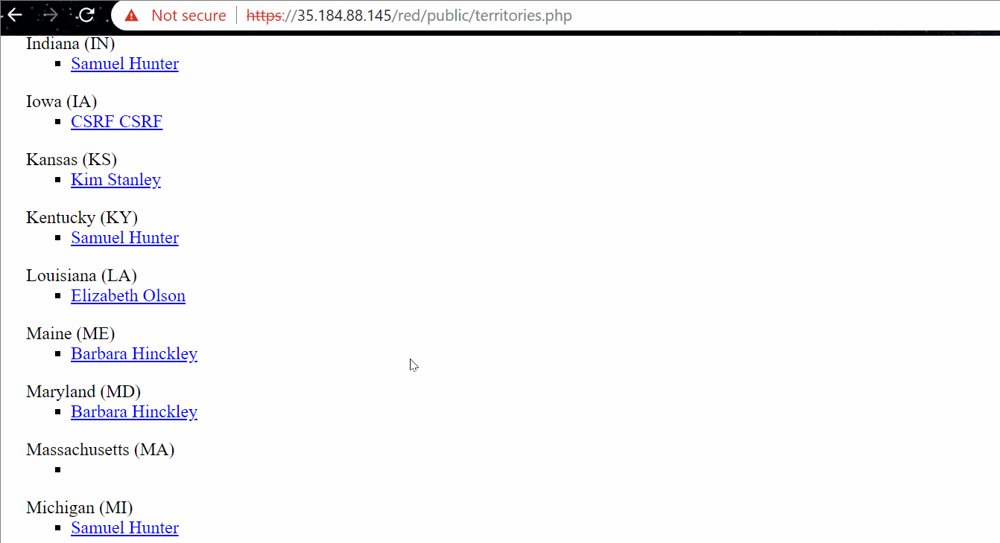

# Project 8 - Pentesting Live Targets

Time spent: **9** hours spent in total

> Objective: Identify vulnerabilities in three different versions of the Globitek website: blue, green, and red.

The six possible exploits are:
* Username Enumeration
* Insecure Direct Object Reference (IDOR)
* SQL Injection (SQLi)
* Cross-Site Scripting (XSS)
* Cross-Site Request Forgery (CSRF)
* Session Hijacking/Fixation

Each version of the site has been given two of the six vulnerabilities. (In other words, all six of the exploits should be assignable to one of the sites.)

## Blue

Vulnerability #1: SQLi

Inject the following SQL command instead of an ID number: " OR SLEEP(1)=0-- " The page will "sleep" for 1 second, while counting down and then returns "true" or "1" because 0 == 0, at which time it will query the database for the salesperson with ID=1, Daron Burke. 

Vulnerability #2: Session Hijacking/Fixation

Log into Google Chrome's blue site, and use the session ID tool to view the session ID of the page. Then, copy that same session ID into the Microsoft Edge browser site. This will convince the server that the Microsoft Edge browser is the same as the Chrome browser and that you've logged in before. This will automatically log you in when you reload the login page. 

## Green

Vulnerability #1: Cross-Site Scripting (XSS)

Go to the Feedback section of the webpage and enter a XSS script in the comments to output an alert of your desire. I used . This will cause an alert with the selected message to pop up when viewing the feedback page when logged in. 

Vulnerability #2: Username Enumeration

If you use a username that exists, then the login issue message will be bolded. If you try to enter a made up username, then the message returned will be unbolded. This is because the Developer the error message is either failed and failure, depending on whether the username actually exists. 

## Red

Vulnerability #1: Insecure Direct Object Reference (IDOR)

There is an employee in the database that should not be published to the public site until a later date. However, by changing the ID number in the URL to 10, his profile is still visible. 

Vulnerability #2: Cross-Site Request Forgery (CSRF)

Run the following HTML code in order to change the user with ID=4 to your specified and made up salesperson. 
<html>
  <head>
    <title>This is a form</title>
  </head>
  <body onload="document.my_form.submit()">
    <form action="https://35.184.88.145/red/public/staff/salespeople/edit.php?id=4" method="POST" name="my_form" style="display: none;" target="hidden_results" >
      <input type="text" name="first_name" value="Michael" />
      <input type="text" name="last_name" value="Scott" />
      <input type="text" name="phone" value="123-456-7890" />
      <input type="text" name="email" value="fake_email@papersales.com" />
    </form>
    <iframe name="hidden_results" style="display: none;"></iframe>
  </body>
</html>

## Notes

Describe any challenges encountered while doing the work
